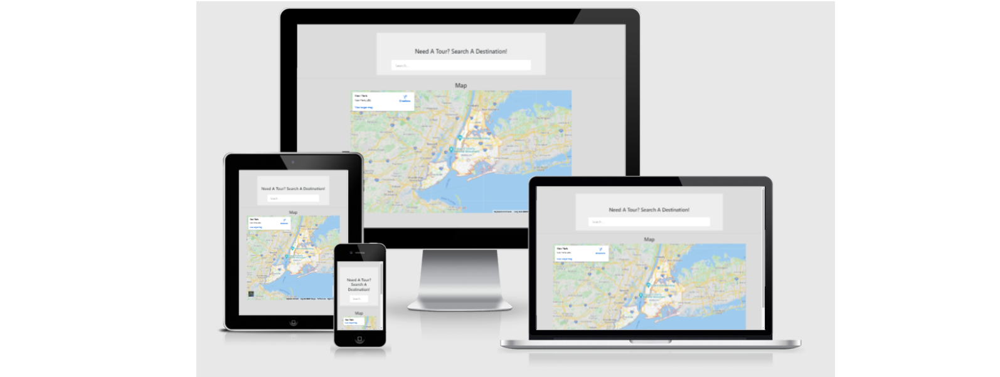

# GlobeTrot
Tourism Guide

<a href="https://denaman.github.io/GlobeTrot/">GlobeTrot</a> is my second milestone project as a "Full Stack" Software Development student of the <a href="https://codeinstitute.net/">Code Institute</a>. It is one of four 
projects that are intended to showcase my skills and credentials for potential employers or collaborators to access.
