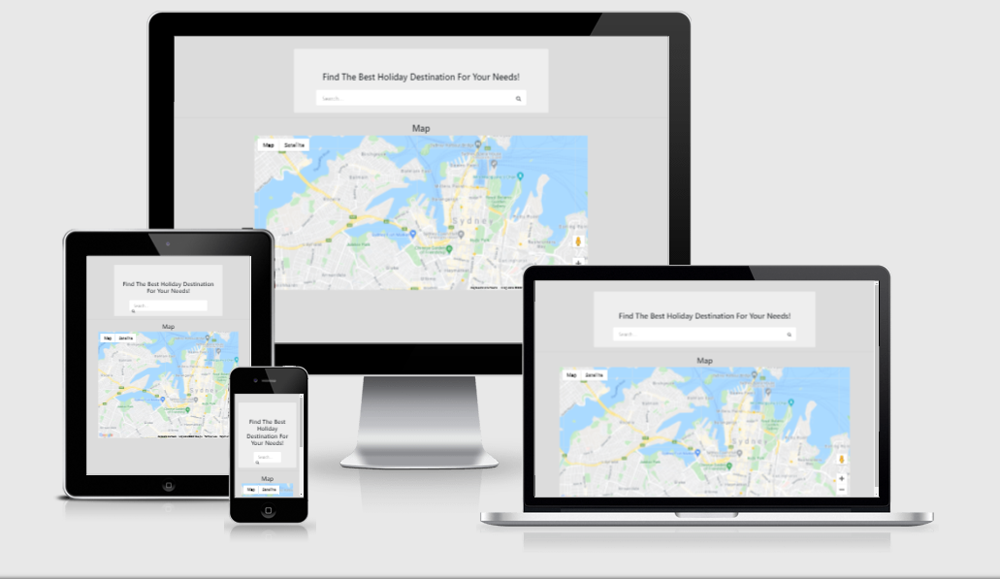

# GlobeTrot
Tourism Guide

<a href="https://denaman.github.io/GlobeTrot/">GlobeTrot</a> is my second milestone project as a "Full Stack" Software Development student of the <a href="https://codeinstitute.net/">Code Institute</a>. It is one of four 
projects that are intended to showcase my skills and credentials for potential employers or collaborators to access.

## UX

GlobeTrot, an acronym for globetrotting, is a site that allows users to search for a holiday destination of interest. Users are able to search for a city and see fitting attractions, hotels and restaurants.

## Features:

Search box and Google Maps.

### Existing features:
- Search Box: Allows users to search/select a city and see a map with relevant attractions, accomodations and restaurants.
- Google Maps : Displays a map of searched city with relevant attractions, accomodations and restaurants.

### Features left to implement:
- Visual representation of destinations.

## Technologies used:

- [Google Maps Places API](https://cloud.google.com/maps-platform/)
    -The project uses **Google API** as a location based service.

- [JavaScript](https://www.javascript.com/)
    -The project uses **JavaScript,** a programming language, to have the site produce relevant responses dependent on user's actions.
    
- [Hyper Text Markup Language (HTML)](https://developer.mozilla.org/en-US/docs/Web/HTML)
    - The project uses **HTML** as the language to produce the web pages.

- [Cascading Style Sheet (CSS)](https://www.w3.org/Style/CSS/Overview.en.html)
    - The project uses **CSS** to style the various elements on the web pages, including coloration, spacing, fonts / layout sizes and the likes.

- [Bootstrap](https://https://getbootstrap.com/)
    - The project uses **Bootstrap,** a frontend development framework for creating responsive web designs.
    https://getbootstrap.com/

- [Gitpod](https://www.gitpod.io/)
    - The project uses **Gitpod,** an Integrated Development Environment (IDE). Also used in creating and saving codes.

- [jQuery](https://jquery.com/)
    - The project uses **jQuery,** a feature-rich JavaScript library.

- [GitHub]( https://github)
    - The project uses **GitHub,** a Microsoft subsidiary that provides a platform for collaboration and hosting for software development version control using Git.

- [Git](https://git-scm.com/)
    - The project uses **Git,** a version control system (VCS) for tracking changes in computer files and coordinating work on those files among multiple people.

- [W3C Markup Validation Service](https://validator.w3.org/)
    - The project uses **W3C** to validate the HTML and CSS codes. https://jigsaw.w3.org/css-validator/validator

- [Chrome Dev Tools](https://developers.google.com/web/tools/chrome-devtools)
    - The project uses **Chrome Dev Tools** a set of Web Developer Tools built directly into the Google chrome browser.

## Testing:

- The project uses <a href="http://ami.responsivedesign.is/">**Am I responsive**</a> to test the responsiveness of the website on different Apple devices.
  All pages and links functioned as expected on all devices.

- All pages and links displayed and functioned as expected when tested on different browsers, including all viewport sizes.

- All pages and links performed well on all mobile devices via safari and chrome.

## Deployment

### GitHub Pages:
The project was deployed to GitHub Pages (a hosting platform) using the following steps...

- Log in to GitHub and locate the <a href="https://github.com/">**GitHub Repository.**</a>
- At the top of the Repository (not top of page), locate the "Settings" Button on the menu.
- Scroll down the Settings page until you locate the "GitHub Pages" Section.
- Under "Source", click the dropdown called "None" and select "Master Branch".
- The page will automatically refresh.
- All pages and links performed well on all mobile devices via safari and chrome.
- Scroll back down through the page to locate the now published site <a href="https://denaman.github.io/GlobeTrot/">**link**</a>  in the "GitHub Pages" section.

## Credits

### Content:
- Text: **Original**.
 
- HTML /CSS code and JavaScript: **Bootstrap**.

## Acknowledgements

- The Code Institue team, including members of the Slack community.

- My mentor, <a href="https://github.com/deye9">**Adegbenga Adeye,**</a> for his unrelenting support.
